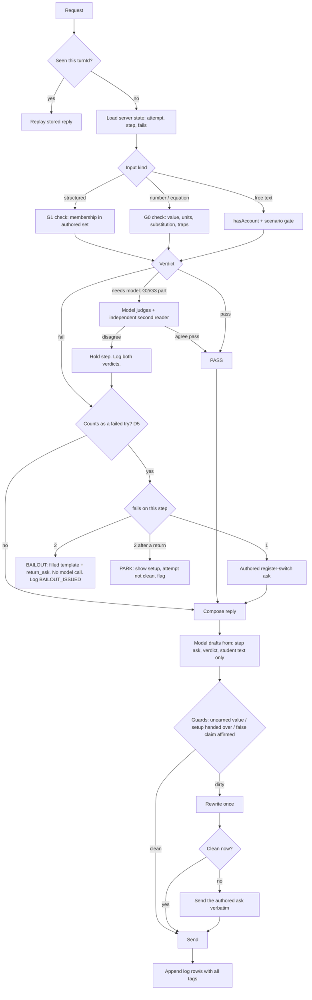

# V3 Architecture Brief — Gen Chem II Socratic Tutor (2027)

**To:** Opus (constructor) · **From:** Fable (consulting architect) · **Owner of all teaching decisions:** the instructor
**Date:** 19 Sept 2026 · **Status: v0.1 DRAFT.** Nothing here is final until the instructor rules on Part A.
**Inputs read:** builder brief, analysis-side brief, `Code_V2-6` (3,541 lines), `index.html`, titration widget, archetype CSV, workflow map, student traps, scholarship notes, Gemini blueprint.
**Inputs named but not received:** `V2_CHANGES.md`, `NOTE_TO_ANALYSIS_SIDE.md`, the offline test suite, the simulated-student harness, the instructor's model answers for the openers, the lab manual. Get these before Phase 1.

**Standing rules for every deliverable you produce (Opus):**
1. Two sections, always: **NEEDS YOUR DECISION** (short list, plain English, with a recommendation) then **ENGINEERING** (skippable).
2. You draft, the instructor approves. Teaching text you write is marked `DRAFT` until he signs it.
3. Any chemistry claim gets checked with him before it is encoded. V2 encoded one false trap by skipping this.
4. No praise, no padding, plain speech.
5. Builder and analyst stay separate lanes. You build. You do not grade your own build.

---

# PART A — NEEDS YOUR DECISION (instructor)

Each item has my recommendation. Reply "agree" or change it. Defaults below are what Part B assumes.

| # | Decision | Recommendation | Why |
|---|---|---|---|
| D1 | Does every problem still open with a hidden-problem particle question (V2's step 1)? The new CSV replaces it with "extract data from the problem" for many archetypes, which requires the problem to be visible. | **Keep V2's opening for all archetypes.** Frameworks take over from step 2. | Withholding the problem is the best-evidenced move in the project. The opener scenario already is the macroscopic start of the triad. |
| D2 | Exactly five steps everywhere, or variable? | **Allow 4–6. No filler steps.** Last step is always the credit gate. | Forced fives produced "Polynomial Root Finding: execute the division" and a "bypassed" step. Log by step ID, not number. |
| D3 | Picking from a list is checkable but is recognition, not recall. Typing is recall but only a model can judge it. | **Write first, then pick.** Student types their account; then a structured check appears. The pick is the gate; the text is logged and used later. | Keeps the thinking. Gives two independent readings of the same idea. A mismatch between them is the most useful signal you can log. |
| D4 | Failure ladder. V2 has five rungs; rung 5 hands over the setup, which you dislike. | **Try → fail → re-ask from a different account (particles ↔ symbols ↔ measurement) → fail → notebook prompt.** Rungs 3–5 retired. | Keeps your register-switch idea. Meets your 2-fail rule. Ends setup handover. |
| D5 | What is a "failed try"? | **Wrong answers only.** Not questions, not a units-only slip on an otherwise right number, not network retries, not off-topic. | Otherwise the notebook fires for typos and for good questions. |
| D6 | After returning from the notebook, two more fails. Then what? | **"Park" the step:** show the setup, mark the attempt not clean, no credit for that attempt, flag it for you. Student may start a fresh variant. | A hard stop strands them. Endless loops teach nothing. |
| D7 | Who writes the notebook prompt? | **A fill-in template you approve per step.** Not written live by the model. | A model-written prompt is one more place for the answer to leak. A template cannot contain the problem's numbers. It also needs no model call, so it is instant. |
| D8 | Credit gate (last step). | **Never model-only.** Structured pick + a written account built from the student's own transcript, read by two independent readers. | It is the credit gate and in V2 it is 100% opinion. |
| D9 | The one number. | **Primary: Transfer Gap** (exam, no tool). **Build quality: USA.** **Weekly pulse: first-try clear rate.** See B2. | USA measures the instrument, not the student. It can hit zero while nobody learns. |
| D10 | Simulations: require a committed prediction before the sim opens? | **Yes.** Predict → observe → explain. | Makes the sim a test of their claim, not a source of it. The prediction is checkable. |
| D11 | Pilot archetypes (build three fully before touching the other 26). | `ch13_ice` (state-space), `ch12_rates` (decision-based), `ch11_colligative` or `ch14_titration` (mechanistic). **Swap toward whichever match a lab.** | One per framework. ICE and ch11 have V1 baselines for before/after comparison. |
| D12 | Student identity. Now a typed ID. | **School Google sign-in** before any exam credit attaches. | Typed IDs cannot carry grades or research. |
| D13 | Randomly assign each student a "focus set" of archetypes that carry credit? | **Yes if IRB allows.** Optional. | Turns the Transfer Gap from a correlation into an experiment. See B2. |

**I also need from you (not decisions, inputs):**
- Three sentences each, in your words: what makes a step Decision-Based, State-Space, or Mechanistic-Epistemic. These become the tagging rubric. DBL has a literature (Sansom 2019). The other two are your constructs; they need operational definitions before anyone can publish on them.
- Lab list: experiments, order, what students measure, how data is recorded.
- Target term and expected enrollment.
- Does the college run Google Workspace for Education, and can students open NotebookLM there? (Note: as of mid-2026 Google appears to be rebranding it "Gemini Notebook". Only the Enterprise edition has an official API.)
- IRB status, if this is to be research.

---

# PART B — ENGINEERING

## B0. Bottom line

V2's lesson, stated by both prior briefs and confirmed in the code: **checks hold, instructions leak.** V3 is therefore organised around one question asked of every step: *what can a computer check here?* The three pedagogical frameworks are not decoration. They are the source of checkable structure for the steps that have never had a gate.

Five structural moves:
1. **Content is data.** Every step is a row with tags, a question, a gate spec, and an owner.
2. **Every step has a gate class.** The ungated share becomes a build output.
3. **The model loses two jobs**: judging structured answers, and writing anything that can be authored. It keeps: phrasing, acknowledging, handling off-script questions.
4. **One chemistry core, three hosts.** Pure JS library used by Apps Script now, Netlify later, Node tests always, and the browser sims. Migration becomes an adapter swap.
5. **The answer key leaves the page in Phase 1**, not Phase 2.

## B1. What I would not carry forward from the supporting documents

Blunt, because these are ideas and not plans:

- **The archetype CSV / workflow map predates V2's content fixes.** It tags per archetype (all five steps identical). It reintroduces step 5s that V2 deliberately removed (`ch13_ice`: "verify by substituting back into Kc", which V2's code comments forbid as "a number, not an account"; `ch12_integrated`: "audit logic using half-life intuition", which the builder brief cites as "not a question"). Its step 1s need the hidden problem. **Baseline content = V2's `WORKFLOWS`, `OPENERS`, `OPENER_KEYWORDS`, `TRAPS`, `TRAP_WATCH`. The CSV is a first guess at framework assignment, nothing more.**
- **Its labels are forced.** "Thermodynamic Driving Force: convert temperature to Kelvin." A unit conversion is execution. Tag it as such.
- **Its citations need work before publication.** Guo 2021 (a scientometric review of tutoring systems) appears on every row. Rahmawati 2022 is a PhET study, not a foundation for a mechanistic-epistemic framework. Leads for the instructor to check himself, not citations from me: mechanistic reasoning (Russ et al.; Talanquer; Cooper's CLUE work), predict-observe-explain (White & Gunstone), extent of reaction (Solaz & Quílez, already listed).
- **Gemini blueprint, four problems.** (a) It fuses framework with Johnstone level ("Mechanistic-Epistemic = Submicroscopic"). They are separate axes. (b) "The tutor generates a customized notebook prompt" — template it instead (D7). (c) "Real-time heatmap in the analysis notebook" — a notebook does not count. Numbers come from the sheet. Consumer NotebookLM has no official write API. (d) "Stream via SSE in <800 ms" contradicts "output guards rewrite the draft." You cannot veto tokens the student has already read. See B9.
- **Titration widget.** Good lab-like interaction (burette, drops, colour, live curve). Not usable as built: 300 lines of a Google host framework (`WH.*`, `postMessage` to a parent), fixed acid (Ka 1.8e-5, 25.0 mL), no link to the problem or the answer key. That is exactly the failure that let V1's titration sim show pH 7 against a grader holding 5.97. Minor physics artefact: the first drop dips the curve below the starting pH (H-H applied at 0.1 mL). Keep the interaction design; rebuild on the shared model.
- **V2's veil is cosmetic.** `problemPools` with every `solve` block ships in `index.html`. Sim gating reads `sessionData.milestone` in the browser. The client posts its own `problemConfig` to the server. A student with dev tools has the key and could in principle post a doctored one.

## B2. Measurement: the one number

**USA is not it.** It is a property of the build. It answers "how much of what we log can be trusted," which is a precondition for every other number. Drive it to zero by turning every step into multiple choice and you have a perfectly gated course that teaches recognition.

Three numbers, three jobs:

| Number | Job | Definition | Cadence |
|---|---|---|---|
| **Transfer Gap (TG)** | *Is it working?* | Per student: mean standardised score on exam items whose archetype they finished cleanly before the exam, minus mean on items whose archetype they did not. Items standardised against the class mean for that item. Average over students, with an interval. | Per exam |
| **USA** | *Can we trust the instrument?* | Share of steps whose gate class is G3 (model opinion only). Report three ways: by step count; **by credit gates only**; by exposure (share of logged student turns on G3 steps). | Every build, automatically |
| **First-try clear rate** | *Weekly pulse* | Share of gated steps cleared on first attempt, no notebook. By archetype × framework × register. | Weekly |

Notes:
- TG is within-student, so "the strong students are the ones who use it" largely cancels. What remains: students choose *which* archetypes to do. D13 (random focus sets) removes that. Without D13, report TG as a correlation and say so.
- TG requires one identifier shared by tutor, exam item, and lab. Same string, no mapping table. Keep V2's archetype keys unchanged.
- **Pair USA with Generation Share** = share of steps where the student must produce text, a number, or an equation rather than pick. If USA falls because Generation Share fell, that is not progress. Both go in the build report.
- V2 baseline for the record (my rough count from `SOLVERS`; compute it exactly): steps 1 and 5 are model-judged in all 29 archetypes; roughly 55% of all steps have no deterministic target; **the credit gate is 100% G3.**
- Guess rates matter. A three-option pick passes by luck 33% of the time, 56% in two tries, and after two wrong picks the answer is known by elimination. Hence: prefer multi-select, ordering, and matching over single-pick; log first-try correctness; add a **random-clicker** simulated student and require it to get nowhere.

## B3. The step model

Three independent tags per step, plus the gate. All four are written to every log row.

| Axis | Values | Meaning |
|---|---|---|
| `register` | `macro` · `submicro` · `symbolic` · `inference` | Which of Johnstone's accounts the student is working in |
| `framework` | `DBL` · `SS` · `ME` · `EXEC` | Which pedagogy governs the step. `EXEC` = plain execution (arithmetic, unit conversion) |
| `gate` | `G0` · `G1` · `G2` · `G3` | How clearing is decided |
| `input` | `number` · `equation` · `pick` · `multipick` · `order` · `match` · `table` · `direction` · `text` | What the student physically does |

Gate classes:
- **G0 deterministic value.** Number with units, equation by substitution, bounds. V2's grader, kept.
- **G1 structural.** Finite authored set, server checks membership. No model involved.
- **G2 hybrid.** G1 pick gates the step; free text is judged by the model *and* an independent second reader; both verdicts logged; disagreement holds the step.
- **G3 model only.** Allowed only where nothing else is possible, never on a credit gate (validator enforces), and always with the second reader.

What each framework contributes as checkable structure:

| Framework | Typical gate | Input | Example |
|---|---|---|---|
| **DBL** | G1/G2 | pick / order from authored alternatives; distractors map to misconception IDs | "Which two trials isolate reactant A?" (multipick of trial rows) |
| **SS** | G0/G1 | state table cells; direction; bounds (0 < x < initial) | ICE grid: each cell is a symbol or number checked by the equation engine; "Q will rise / fall / not change" |
| **ME** | G1/G2 | particle inventory (multipick from a chapter-wide palette with distractors); claim ↔ evidence match; then written account | "Which species are present in the flask at this point?" then "which measurement tells you so?" |
| **EXEC** | G0 | number + units | V2 numeric grader unchanged |

Palette rule: option lists are themselves hints. Palettes are authored once per chapter, shared across all variants, and always include the registry's misconception species. They are never generated per problem.

### Step schema (draft)

```json
{
  "archetype_id": "ch13_ice",
  "step_id": "ch13_ice.s3",
  "index": 3,
  "register": "symbolic",
  "framework": "SS",
  "gate": "G0",
  "input": "table",
  "ask": "Fill in the change row for each species, in terms of x.",
  "clears_when": { "type": "ice_change_row", "source": "model.ice.changes" },
  "may_not_say": ["any coefficient", "any sign", "any value from the problem"],
  "misconceptions": ["COEFFICIENT_NOT_SQUARED", "INITIAL_IN_K_EXPRESSION"],
  "repairs": { "COEFFICIENT_NOT_SQUARED": "…authored question…" },
  "register_switch_ask": "…authored question from the particle account…",
  "bailout_template": "I am working on how concentrations change together as a reaction moves toward equilibrium. Explain, using a reaction different from any I name, why … Then give me one short practice question and wait for my answer.",
  "return_ask": "In your own words, what did the notebook show you about how the changes are tied together?",
  "credit_gate": false,
  "owner": "instructor",
  "approved": "2026-10-04",
  "status": "approved"
}
```

All teaching strings above are placeholders. Do not ship them.

**Authoring surface: a Google Sheet, one row per step.** The instructor reviews a table, not code. Pipeline: Sheet → JSON export → validator → build. The JSON's hash is the `content_version`, logged on every row, so a re-tag is self-dating even when the code build stamp does not move.

**Validator refuses the build if:** any step lacks tags, `ask`, gate spec, `bailout_template`, or `return_ask`; any row in a production build is not `approved` with owner and date; any credit gate is G3; any distractor lacks a misconception ID; any `bailout_template` or `ask` contains a digit string found in any variant's data; any last step's `clears_when` is a calculation.

## B4. Turn flow



New relative to V2:
- **Authored fallback** (W). Because every step has an approved `ask`, a guard failure never has to reach the student. V2 sent the better of two drafts.
- **Bailout and pure-pick turns need no model call.** Faster, cheaper, leak-proof.
- **Failed-try counter replaces the five-rung ladder.** Keep V2's `turn_kind` classification; it is what makes D5 possible.
- Keep from V2 unchanged: `turnId` idempotency, same-words replay, one-step-only prompt scoping, `previewChain`, bookend rule (first and last step each earned in their own turn), multi-value targets graded as a set, `notThese`, freshness note.
- Fix from the analysis brief: the "numbers a student could legitimately have" set must be **enumerated by the solver**, not closed combinatorially (31–44% of random numbers passed as legitimate working in V1).

## B5. Notebook integration

No official API exists for the consumer/Workspace notebook. Unofficial clients exist and ride on reverse-engineered endpoints; do not build a course on them. Design for copy-and-paste and Drive-synced sources, both of which are stable.

**(a) Knowledge-ground notebook (student-facing)**
- Trigger: second counted fail on a step (D4, D5).
- UI: a card with the filled prompt, a **Copy** button, an **Open notebook** link, and an **I'm back** button. Chat input is disabled until "I'm back."
- The template asks for the *idea*, a worked example of a *different* system, and one practice question. It never carries the problem's substances or numbers (validator-enforced).
- On return the tutor asks the step's `return_ask`. The student must say what they learned before the step resumes. This is the "articulation before help" gate from the SocraticAI work, placed where it costs least.
- Corpus rule: textbook, appendices, lab manual, instructor notes. **No worked solutions of pool problems.** Opus: write a script that searches the corpus export for each variant's distinctive number strings and fails if found.
- Log events: `BAILOUT_ISSUED`, `BAILOUT_RETURN` (with seconds away), and whether the next attempt cleared. "Did the notebook trip help" becomes a countable question per step.
- Post-return turns carry `after_bailout=true`. What a student says after reading a source has a different status from what they said before.

**(b) Analysis notebook (instructor-facing)**
- Rule kept from the analysis side: **if the answer is a number, it comes from the sheet; if it is a sentence, it comes from the notebook.**
- A scheduled job writes one Google Doc per archetype per week into a Drive folder: transcripts with each turn annotated `[step_id | register | framework | gate | verdict | trap | fails | guards | after_bailout]`. Those Docs are the notebook's sources. Native export replaces the pipeline's reconstruction.
- Student IDs are replaced with stable pseudonyms before anything enters a notebook. Key stays in a sheet only the instructor can open.
- The "heatmap" is a pivot on the Log sheet (archetype × step × fail/bailout rate), or Looker Studio on the same sheet. Build it as a sheet tab first.
- Also add to the notebook's sources: the framework definitions and the content sheet export, so questions like "where do ME steps fail differently from DBL steps" can cite both.

## B6. Simulations

- **One model, many views.** `core/models/<type>.js` exports pure functions (`state(params)`, `curve(params, range)`, `answer(params)`). Grader, sim, and tests all import it. The sim-vs-key assertion from V2 becomes trivially true and stays as a test.
- **Structural veil.** Server releases the sim payload only when the prediction step clears. Before that the browser does not have the data.
- **Predict → observe → explain (D10).** Before reveal, a G1 prediction (direction, shape, which side of a threshold). Sim opens with: true model curve, **the student's own submitted values plotted on it**, and their prediction marked. The last step's question is built from any gap between the three.
- **Three panes**, one per account: particles (population view, schematic, not molecular dynamics), symbols (their equation and table, live), instrument (the curve or readout). Moving a control updates all three. Start with the pilots; do not build 29.
- **Manipulation logging.** Batch per control: start, end, min, max, count, dwell. Sent with the next turn. Event type `SIM`. Do not send per-frame events through Apps Script.
- **Lab mirror.** Where a lab exists, the instrument pane looks like the apparatus and uses the lab's units and ranges.
- Keep V2's headless run: nothing drawn before its gate, every control to both ends, no NaN.

## B7. Lab

Blocked on the lab list. Proposed shape:
- `lab_id` on archetypes that have a matching experiment. Same ID on the lab handout and the exam item.
- **"Your data" variant.** Student enters their own measurements. Because grading is by model, not by answer list, the solver computes the key from their numbers. Plausibility bounds reject nonsense. This is the one macroscopic anchor that cannot be read off a page or pasted from another tab.
- Their data points overlay the sim curve. The gap between their points and the model is a ready-made last-step question (error, assumptions, what the particles were doing that the model ignores).
- Pre-lab mode (standard variant, prediction of what they will see) and post-lab mode (their data).

## B8. Log contract v3

Append-only. Read by header name. New fields appended, never inserted. **One row per event**, not per turn.

`ts · build_stamp · content_version · event_type · session_id · student_pseudonym · attempt_id · archetype_id · problem_id · variant · lab_id · step_id · step_index · register · framework · gate · input_kind · entering_step · leaving_step · fails_entering · counted_fail · after_bailout · student_text · structured_response · first_try · grader_verdict · trap_ids[] · model_claim · second_reader_verdict · readers_agree · guards_fired[] · fallback_used · reply_text · model_name · model_ms · server_ms · experiment_id · exploratory`

`event_type` ∈ `PROBLEM_OPEN · TURN · BAILOUT_ISSUED · BAILOUT_RETURN · PARK · SIM · LAB_DATA · RESET · COMPLETE`

- `build_stamp` has documented fields: `project-version-date-seq`. No letter suffixes with private meanings.
- Re-tag experiments: `experiment_id` set in advance from a pre-registration note; anything else is `exploratory=true`. Analysis refuses to draw conclusions across that flag.
- Any detector that reads definitions from code records the build it read and refuses rows from another build.

## B9. Platform

**Phase 1, Apps Script.**
- Layout: `core/` (pure: models, solvers, units, equation engine, gates, turn state machine, guards' deterministic parts, log-row builder) and `adapters/gas/` (Sheets, CacheService, LockService, UrlFetch, triggers). `core/` must run under Node with no Google objects. That is what keeps the offline suite at one second and makes Phase 2 cheap.
- **Pool and keys move server-side now.** Client asks for `{archetype_id}`; server picks the variant, holds the key, returns only the opener. Problem text is sent when step 1 clears. Sim payload when the prediction clears. Client never posts a `problemConfig` again.
- Model adapter behind one interface. Consider a different model family for the second reader: the point of a second reading is an unrelated failure mode.
- Identity per D12: deploy as domain-restricted web app if Workspace is available.

**Phase 2, Netlify.**
- Synchronous functions default to 10 s and can be raised to 26 s on request; V2's guarded turns run 16–20 s. **Use Edge Functions** (limited by CPU time, not wall time; can stream) or background functions. Verify current limits on the day; they move.
- **Streaming and guards conflict.** Resolution: stream the *deterministic verdict* immediately (a chip: "263 K ✓ checked", "units missing", "pick recorded"), hold the model's sentence until guards pass. Perceived wait drops to under a second; nothing unguarded is ever shown. Do not stream raw model tokens to students.
- State: a key-value store (Netlify Blobs or similar). Log sink: keep the Google Sheet via a service account so the analysis pipeline and the notebook exports do not change. Revisit only if write volume demands it.
- Auth: Google sign-in restricted to the school domain.

## B10. Test apparatus (build before features)

Port all of V2's: offline suite (370 assertions), simulated students through the real path, replay of every logged turn through the new grader, headless sim run, guard telemetry, era stamping. Add:
- Content validator (B3) as a build gate.
- **Build report**, auto-generated: USA three ways, Generation Share, gate mix by framework, list of every G3 step with its justification.
- **Random-clicker persona.** Picks at random, types filler. In 200 runs per pilot archetype it must never reach the credit gate. If it does, that step's input type is too guessable: change single-pick to multipick, order, or match.
- **Notebook-corpus leak scan** (B5).
- Second-reader agreement rate as a tracked metric; sample disagreements for the instructor weekly.
- Replay must run V1 and V2 logs through V3 graders for the pilot archetypes, to anchor the before/after comparison the analysis side proposed.

## B11. Build order

Each phase ends with a two-section deliverable and an instructor sign-off. Do not start a phase with open decisions from the previous one.

| Phase | Output | Exit test |
|---|---|---|
| 0 | Part A answered. Framework definitions. Content sheet template. Three pilot archetypes authored on paper (sheet only, no code). | Instructor has approved every pilot row. |
| 1 | `core/` extracted from V2; adapters; server-held pool; log v3; offline suite green under Node. No new pedagogy yet. | V2 behaviour reproduced on replay; key no longer in page source. |
| 2 | Gate classes; structured input widgets (multipick, order, match, table, direction); write-then-pick flow; second reader generalised; authored fallback. | Pilots run end to end; random-clicker fails; build report prints. |
| 3 | Failed-try counter, register-switch, bailout card, return gate, park. Knowledge notebook assembled and leak-scanned. | Simulated students trigger and return from bailout; events logged. |
| 4 | Shared-model sims for pilots: three panes, predict-observe-explain, student values plotted, manipulation log. | Headless run clean; sim equals key. |
| 5 | Weekly transcript export to Drive; analysis notebook; heatmap tab; pseudonymisation. | Instructor asks the notebook a question and the sheet a number, and both answer. |
| 6 | Live pilot, three archetypes, real students. Analysis side reviews. | Agreed go/no-go against first-try clear rate, bailout recovery rate, guard rate, latency. |
| 7 | Remaining 26 archetypes, in chapter order, five or so per batch. **Authoring, not code, is the bottleneck: budget instructor hours.** | Validator green per batch. |
| 8 | Netlify: adapters, auth, verdict-first streaming. | Same offline suite, same replay, green on the new host. |
| L | Lab track, parallel from Phase 4 once the lab list arrives. | One "your data" variant live for one experiment. |

## B12. Open risks

1. **Authoring load.** ~29 archetypes × ~5 steps × (ask + switch-ask + template + return-ask + repairs + options). Several hundred approved strings. Use the knowledge notebook to draft; the instructor still has to read every one. If that is not feasible, cut scope (fewer archetypes) before cutting approval.
2. **Picks as hints.** Every option list tells the student what the space of answers is. Write-then-pick and shared palettes reduce this; they do not remove it.
3. **Adoption.** The scholarship note is right that the likeliest failure is non-use. Exam-linked credit and the "your data" variant are the two levers in this design. Neither is proven.
4. **Notebook availability.** Student access depends on edition, age rules, and a product mid-rebrand. Have a fallback: the same prompt works against the textbook index or any notes; the return gate is what matters.
5. **TG needs numbers of students and exam items this course may not have in one term.** Plan on pooling terms; keep identifiers stable so you can.
